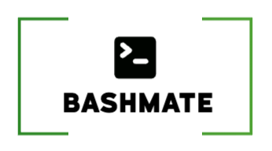

# BashMate 🚀

Your Ultimate Companion for Bash Productivity!



## Description

BashMate is a curated collection of bash commands, functions, and aliases designed to supercharge your terminal experience. Whether you're wrangling Git, managing macOS specifics, or sailing through Laravel tasks, BashMate is here to assist. Explore, contribute, and make your command-line experience efficient and enjoyable!

## Features

- **Shell Scripting Utilities**: Discover a wide range of shell scripts that handle file management, network operations, backup/restore, and more.
- **Alias Management**: Explore a comprehensive set of command aliases and shortcuts to streamline your workflow.
- **Environment Management**: Learn how to manage environment variables using the provided .env.example file.
- **Git Integration**: Dive into the Git-related scripts and configurations that enforce best practices and enhance your version control experience.
- **Language-Specific Tools**: Find integrations and utilities for popular programming languages and frameworks, such as Laravel, Symfony, Composer, Yarn, and Flutter.
- **System Configuration**: Leverage the BrewMate scripts to customize and manage your local macOS development environment, including Apache, PHP, MySQL, and other system-level components.
- **And More!**: Discover various other utilities to boost your productivity.

## Usage

Need help using BashMate ? [Here a GPTMate](https://chatgpt.com/g/g-vJ4SiwFJV-gptmate) that will help you !

## Installation

### Manual Installation

1. Clone the repository:
   ```bash
   git clone https://github.com/LounisBou/BashMate.git
   ```

2. Source the main bash file (or add this to your .bashrc or .zshrc for permanent use):
    ```bash
    cd BashMate
    echo "source $(PWD)/bashmate.sh" >> ~/.zshrc
    ```

3. Restart your terminal or run `source ~/.zshrc` or `source ~/.bashrc` to load the new configuration.

### Automatic Installation

1. Clone the repository:
   ```bash
   git clone https://github.com/LounisBou/BashMate.git
   ```

2. Run the installation script:
   ```bash
    cd BashMate
    chmod +x install.sh
    ./install.sh
    ```

## Usage

**Note**: This section documents various aliases and functions for the bourne again shell. 

The BashMate repository provides a variety of features and tools to enhance your bash-based workflow. Here's a breakdown of how to use different components:

### Shell Scripting Utilities
Explore the scripts in the root directory, such as findin.sh, get.sh, send.sh, and more. These scripts provide useful functionality for common tasks, and you can call them directly from the terminal.

### Alias Management
The aliases and aliases_private folders contain configuration files that define various command aliases and shortcuts. These aliases can be accessed directly in your terminal once the bashmate.sh file is sourced.

### Environment Management
Use the .env.example file as a template to create your own .env file, which can be used to store environment-specific variables across your project.

### Git Integration
The git folder contains scripts and configurations related to Git workflow management. Familiarize yourself with the provided aliases and functions, such as gcreate, gfs, gff, and git-update, to streamline your Git operations.

### Language-Specific Tools
Explore the folders dedicated to different programming languages and frameworks, such as laravel.sh, symfony.sh, composer.sh, yarn.sh, and flutter.sh. These files provide relevant aliases and functions to enhance your development experience with these technologies.

### System Configuration
The BrewMate folder and associated scripts allow you to manage and customize your local macOS development environment. Follow the instructions in the brewmate.sh file to install and uninstall BrewMate, which handles the configuration of Apache, PHP, MySQL, and other system-level components.

---

## Contributing
We welcome contributions! Whether you're adding new commands, improving existing ones, or fixing issues, your input enriches the BashMate experience. See the [CONTRIBUTING.md](CONTRIBUTING.md) for more details.

---

## RoadMap


---

## License
This project is licensed under the CC BY-NC - see the LICENSE file for details.